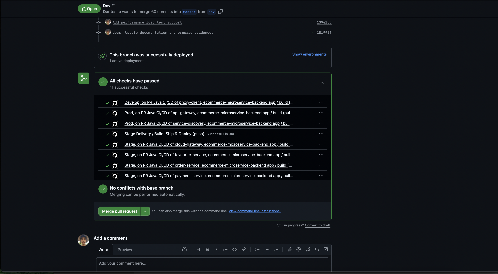
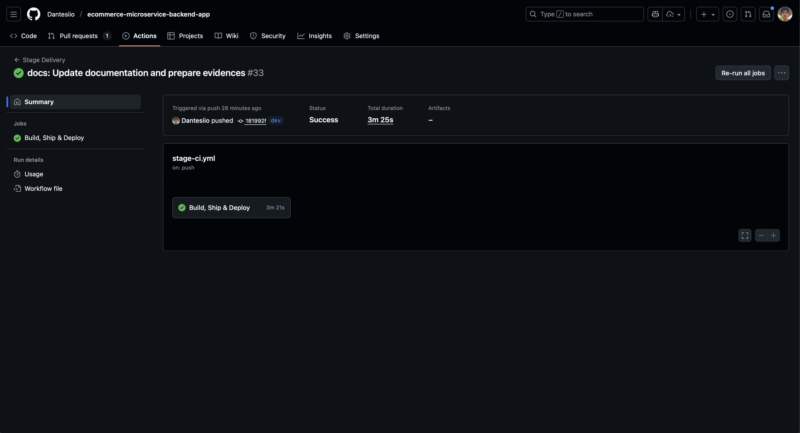

### 1. CI/CD Configuration (10%)

**Plataforma:** GitHub Actions

**Workflows configurados:**
- api-gateway-pipeline-dev-pr.yml
- api-gateway-pipeline-dev-push.yml
- api-gateway-pipeline-prod-pr.yml
- api-gateway-pipeline-prod-push.yml
- api-gateway-pipeline-stage-pr.yml
- api-gateway-pipeline-stage-push.yml
- cloud-config-pipeline-dev-pr.yml
- cloud-config-pipeline-dev-push.yml
- cloud-config-pipeline-prod-pr.yml
- cloud-config-pipeline-prod-push.yml
- cloud-config-pipeline-stage-pr.yml
- cloud-config-pipeline-stage-push.yml
- favourite-service-pipeline-dev-pr.yml
- favourite-service-pipeline-dev-push.yml
- favourite-service-pipeline-prod-pr.yml
- favourite-service-pipeline-prod-push.yml
- favourite-service-pipeline-stage-pr.yml
- favourite-service-pipeline-stage-push.yml
- order-service-pipeline-dev-pr.yml
- order-service-pipeline-dev-push.yml
- order-service-pipeline-prod-pr.yml
- order-service-pipeline-prod-push.yml
- order-service-pipeline-stage-pr.yml
- order-service-pipeline-stage-push.yml
- payment-service-pipeline-dev-pr.yml
- payment-service-pipeline-dev-push.yml
- payment-service-pipeline-prod-pr.yml
- payment-service-pipeline-prod-push.yml
- payment-service-pipeline-stage-pr.yml
- payment-service-pipeline-stage-push.yml
- product-service-pipeline-dev-pr.yml
- product-service-pipeline-dev-push.yml
- product-service-pipeline-prod-pr.yml
- product-service-pipeline-prod-push.yml
- product-service-pipeline-stage-pr.yml
- product-service-pipeline-stage-push.yml
- proxy-client-pipeline-dev-pr.yml
- proxy-client-pipeline-dev-push.yml
- proxy-client-pipeline-prod-pr.yml
- proxy-client-pipeline-prod-push.yml
- proxy-client-pipeline-stage-pr.yml
- proxy-client-pipeline-stage-push.yml
- service-discovery-pipeline-dev-pr.yml
- service-discovery-pipeline-dev-push.yml
- service-discovery-pipeline-prod-pr.yml
- service-discovery-pipeline-prod-push.yml
- service-discovery-pipeline-stage-pr.yml
- service-discovery-pipeline-stage-push.yml
- shipping-service-pipeline-dev-pr.yml
- shipping-service-pipeline-dev-push.yml
- shipping-service-pipeline-prod-pr.yml
- shipping-service-pipeline-prod-push.yml
- shipping-service-pipeline-stage-pr.yml
- shipping-service-pipeline-stage-push.yml
- stage-ci.yml
- user-service-pipeline-dev-pr.yml
- user-service-pipeline-dev-push.yml
- user-service-pipeline-prod-pr.yml
- user-service-pipeline-prod-push.yml
- user-service-pipeline-stage-pr.yml
- user-service-pipeline-stage-push.yml

**Secretos configurados:**
- DOCKER_USERNAME
- DOCKER_PASSWORD
- PROJECT_VERSION

**Justificación:**
- Zero setup (no requiere servidor)
- Integración nativa con GitHub
- Costo: $0
- Logs accesibles en GitHub UI

**Plataforma anterior:** Railway (eliminado)
**Motivo:** No cumple requisitos del taller (Kubernetes requerido)
**Archivos eliminados:** railway.toml, workflows de Railway

## Evidencias de Ejecución

### GitHub Actions

### Tests

